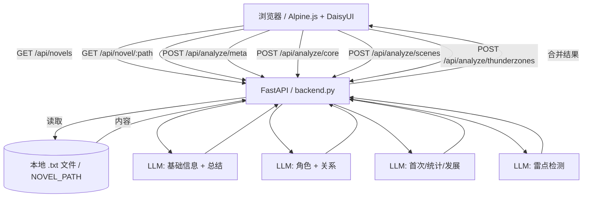

# 涩涩小说分析器

基于 LLM 的本地小说分析工具：角色关系、性癖画像、亲密场景与进度可视化。支持任意 OpenAI 兼容 API；所有敏感配置仅保存在服务端 `.env`。

## 你能得到什么

- 自动扫描本地小说目录（仅 `.txt`）
- 智能分析：角色性格/性癖、人物关系、亲密场景统计
- 世界观标签：自动提取题材/设定标签
- 雷点检测：自动识别绿帽/NTR/女性舔狗/恶堕等雷点
- 淫荡指数：女性角色的性开放程度评分（1-100分）
- 可视化：力导向关系图、首次场景时间线、关系发展进度
- 导出报告：一键导出完整分析报告（HTML格式）
- 更安全的默认值：只监听本机、前端不接触 API Key

## 快速开始（Windows）

```bash
python -m venv venv
.\venv\Scripts\activate
pip install -r requirements.txt
copy .env.example .env
start.bat
```

启动后访问：`http://127.0.0.1:6103`

## 配置（仅服务端 `.env`）

从 `.env.example` 复制为 `.env` 后修改：

```env
NOVEL_PATH=你的小说根目录
API_BASE_URL=https://your-api.com/v1
API_KEY=sk-your-api-key
MODEL_NAME=gpt-4o
HOST=127.0.0.1
PORT=6103
LOG_LEVEL=warning
DEBUG=false
```

| 配置项         | 说明                   | 示例                         |
| -------------- | ---------------------- | ---------------------------- |
| `NOVEL_PATH`   | 小说根目录             | `X:\Gallery\h小说`           |
| `API_BASE_URL` | OpenAI 兼容 API 地址   | `https://api.example.com/v1` |
| `API_KEY`      | API 密钥（仅服务端）   | `sk-xxx`                     |
| `MODEL_NAME`   | 模型名称               | `gpt-4o`                     |
| `HOST`         | 监听地址（默认仅本机） | `127.0.0.1`                  |
| `PORT`         | 端口                   | `6103`                       |
| `LOG_LEVEL`    | 日志级别               | `warning`                    |
| `DEBUG`        | 显示 LLM 原始响应错误  | `false`                      |

## 运行与开发命令

- 一键启动（会安装依赖并启动服务）：`start.bat`
- 手动启动：`python backend.py`
- 开发热重载：`uvicorn backend:app --reload --host 127.0.0.1 --port 6103`

## 使用步骤

1. 打开 `http://127.0.0.1:6103`
2. 顶部下拉框选择小说
3. 点击"开始分析"，查看各个 Tab 的结果
4. （可选）分析完成后点击"导出"下载 HTML 报告
5. （可选）"日志" Tab 查看详细操作日志
6. （可选）右上角"配置（只读）"里点击"测试连接"

### 功能 Tab

| Tab        | 功能说明                             |
| ---------- | ------------------------------------ |
| **进度**   | 分析流程进度与步骤可视化             |
| **总结**   | 快速统计、角色一览、剧情总结         |
| **雷点**   | 检测绿帽/NTR/女性舔狗/恶堕等雷点     |
| **角色**   | 男性角色、女性角色（含淫荡指数排行） |
| **关系图** | 力导向图 + 关系详情列表              |
| **首次**   | 每对角色的首次亲密场景               |
| **统计**   | 完整亲密场景时间线                   |
| **发展**   | 关系发展里程碑                       |
| **日志**   | 操作日志和错误信息                   |

## API 端点

| 端点                        | 方法 | 说明                   |
| --------------------------- | ---- | ---------------------- |
| `/api/config`               | GET  | 获取服务端配置（只读） |
| `/api/novels`               | GET  | 扫描小说目录           |
| `/api/novel/{path}`         | GET  | 读取指定小说内容       |
| `/api/test-connection`      | GET  | 测试 API 连接          |
| `/api/analyze/meta`         | POST | 基础信息 + 剧情总结    |
| `/api/analyze/core`         | POST | 角色 + 关系 + 淫荡指数 |
| `/api/analyze/scenes`       | POST | 首次场景 + 统计 + 发展 |
| `/api/analyze/thunderzones` | POST | 雷点检测               |

## 分析流程



### 核心机制

#### 1. 多次 LLM 调用（并行 + 约束）
- **A/B 并行**：基础信息+总结 & 角色+关系+淫荡指数
- **C/D 并行**：首次/统计/发展 & 雷点检测（输入必须携带角色/关系名单，确保一致）

#### 2. 严格校验（不自动补全）
- 性别必须为 `male` / `female`（支持中文/英文近义词映射）
- 关系/场景/雷点中的角色必须出自角色表
- 任一环节失败则整体失败（不做自动补齐）

#### 3. 特殊处理
- **第一人称叙述者（提示词级）**：在 `core` 阶段提示词要求模型将第一人称叙述者（"我"）视为角色并尽量给出别名；后端不做额外自动推断，仍以 LLM 输出为准
- **淫荡指数**：女性角色的性开放程度评分（1-100），包含详细分析
- **雷点检测**：识别绿帽、NTR、女性舔狗、恶堕等，标注严重程度（高/中/低）

## 输出校验（严格失败）

- **提示词加固**：强制输出纯 JSON、字段齐全
- **强一致性**：角色性别必须合规，所有引用必须出自角色表
- **不自动补全**：任何不合规直接失败，避免“表面可用但数据错乱”

### LLM 输出解析链路（当前实现）

后端每个分析端点都遵循同一条链路：

1. `call_llm_with_response()` 调用 OpenAI 兼容接口 `POST {API_BASE_URL}/chat/completions`（当前使用 **stream** 模式）
2. 拼接流式返回的 `delta.content`（或 `delta.reasoning_content`）得到最终文本
3. `extract_json_from_response()` 从文本中“尽力提取” JSON
4. 分阶段 `_validate_*()` 做严格 schema 校验
5. 任何一步失败都返回 `HTTP 422`（前端弹窗 + 日志可见）

### JSON 提取策略（`extract_json_from_response`）

当前仅支持以下 3 种情况（按顺序尝试）：

1. **整段内容就是 JSON**：`json.loads(text)`
2. **```json 代码块**：提取第一个 ```json ... ``` 并 `json.loads()`
3. **首尾大括号截取**：用正则从第一个 `{` 到最后一个 `}` 截取并 `json.loads()`

这意味着它对下列常见输出非常敏感（容易直接解析失败）：

- **JSON5/不规范 JSON**：单引号、尾逗号、注释、`NaN`/`Infinity`
- **多段 JSON/夹杂解释**：模型输出了两个对象、或在 JSON 外再包一层说明
- **输出被截断**：末尾缺 `}` / 缺引号
- **键名/结构变形**：把 `characters` 写成 `角色列表`，或把数组写成对象

### 分阶段校验要点（失败即终止）

- **Meta**（`/api/analyze/meta`）
  - 必须返回 `novel_info`（对象）与 `summary`（非空字符串）
- **Core**（`/api/analyze/core`）
  - `characters` 必须是数组；每个角色必须含 `name/gender/identity/personality/sexual_preferences`
  - 女性角色必须额外含 `lewdness_score`（可转 int）与 `lewdness_analysis`
  - `relationships` 必须是数组；且 `from/to` 必须引用 `characters` 里出现的名字
- **Scenes**（`/api/analyze/scenes`）
  - `participants` 必须来自允许名单；`chapter/location/description` 必须是非空字符串（不知道请写“未知/未提及”）
- **Thunder**（`/api/analyze/thunderzones`）
  - `involved_characters` 必须来自允许名单；`severity` 会被规范化到 `高/中/低`

### 提示词约束要点（按端点）

后端提示词全部以 **user message** 形式发送，并用“Output JSON ONLY/Required keys/Allowed names”等规则约束模型输出；但这类约束对不同模型/不同供应商的遵循度差异很大，是当前脆弱性的主要来源之一。

- **Meta**
  - 强制：只输出一个 JSON 对象
  - 强制：包含 `novel_info` 与 `summary`
- **Core**
  - 强制：只抽取“发生性行为”的角色
  - 强制：`gender` 必须是 `male|female`（小写英文）
  - 强制：女性包含 `lewdness_score(1-100 int)` 与 `lewdness_analysis`
  - 强制：如第一人称叙述者（"我"）参与，必须纳入角色（能推断则给别名，否则用"我"）
- **Scenes**
  - 强制：`participants` 只能来自上一阶段提供的角色名单（prompt 注入 allowed names JSON）
  - 强制：未知信息用“未知/未提及”，不要留空
- **Thunder**
  - 强制：`involved_characters` 只能来自角色名单
  - 强制：`severity` 必须落在 `高/中/低`
  - 强制：键名必须精确匹配（type/severity/description/involved_characters/chapter_location/relationship_context）

常见违例来源：

- **模型喜欢解释**：在 JSON 前后附带自然语言说明/Markdown
- **字段名漂移**：把英文 key 翻译成中文、或自造同义字段
- **结构漂移**：把数组/对象互换，或把字段嵌套层级改变
- **截断**：输出 token 不够导致 JSON 半截（尤其是 long novel content + 长列表）

### 为什么“拆成多次调用”仍然脆弱

拆分调用能减少单次任务复杂度，但**不能保证结构化输出稳定**：

- 模型仍可能输出 Markdown、解释性文本、或不完整 JSON
- 模型可能“自作主张”新增字段/改字段名/改数据结构
- 严格校验会把这些偏差全部视为错误（这是有意的：宁可失败也不接受错数据）

### 调试与排障

- **启用原始响应回显**：在 `.env` 设置 `DEBUG=true`，重启后端，再次分析
  - 调用失败/解析失败时（例如返回非 JSON），接口返回的错误信息会附带截断后的 LLM 原始响应片段
  - Schema 校验失败时目前只返回字段错误列表（不会附带原始响应），可结合前端“日志”Tab定位具体破坏的约束
- **前端查看日志**：失败后切到“日志”Tab，能看到每一步报错原因
- **先测连通性**：右上角配置里点击“测试连接”（对应 `/api/test-connection`）

### 降低失败率的建议（文档级建议，非当前实现）

- **降低温度**：结构化抽取建议 `temperature=0~0.3`（当前实现为 `0.7`）
- **使用 JSON 模式/Schema 模式（如果你的 API 支持）**：例如 OpenAI 的 `response_format`/JSON Schema
- **二次修复（Repair Pass）**：当校验失败时，把“错误列表 + 原始输出”喂回模型，让它只做 JSON 修复
- **输入分块**：超长文本可先分段抽取再汇总，减少截断导致的半截 JSON

## 雷点检测

系统能自动识别并标注以下雷点类型：

| 雷点类型     | 说明                                             |
| ------------ | ------------------------------------------------ |
| **绿帽**     | 男性角色的伴侣与他人发生关系（自愿/被迫/不知情） |
| **NTR**      | 主角的恋人/配偶被他人占有                        |
| **女性舔狗** | 女性角色过度顺从，不顾尊严追求男性               |
| **恶堕**     | 纯洁/善良的角色被腐蚀堕落                        |
| **其他**     | 乱伦、SM程度过重、角色死亡等其他雷点             |

严重程度分级：
- **高**：核心剧情涉及，影响主角或主要配角，详细描写
- **中**：支线剧情涉及，影响次要角色，有一定描写
- **低**：背景提及、回忆片段、一笔带过

## 目录结构

```
.
├── backend.py              # FastAPI 后端：扫描文件、调用 LLM、/api/*
├── templates/
│   └── index.html          # 单页前端（Alpine.js）
├── static/
│   ├── style.css           # 样式文件
│   └── chart-view.js       # 可视化渲染（关系图、导出等）
├── requirements.txt        # Python 依赖
├── .env.example            # 配置模板（复制为 .env）
├── start.bat               # Windows 启动脚本
└── tests/                  # E2E 测试和单元测试
    ├── test_export_report_e2e.py
    ├── test_thunderzones_e2e.py
    ├── test_thunderzones.py
```

## 安全与合规

- 默认只监听 `127.0.0.1`；不要随意把 `HOST` 改成 `0.0.0.0`，否则会把本机文件列表/内容暴露给局域网。
- `.env` 不会进 Git；前端不会读取/保存/发送 `API_KEY`。
- 请确保小说与分析用途符合当地法律与内容来源授权。

## 贡献指南

请先读 `AGENTS.md`（包含仓库结构、命令、提交规范与安全注意事项）。

## 许可证

本项目采用 MIT 许可证，详见 `LICENSE`。
